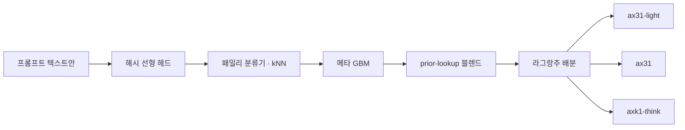

<!--
SPDX-FileCopyrightText: Copyright 2026 SK TELECOM CO., LTD.
SPDX-License-Identifier: Apache-2.0
-->

<div align="center">

# 🧭 SKT LLM Router

**held-out dev 0.7051 · expected 0.7043 · bust 0회**

SKT Efficient LLM Routing Challenge 용 프롬프트 전용 라우터.<br>
런타임은 파이썬 표준 라이브러리뿐이고, **평가 시점에 모델 추론을 하지 않는다.**

<br>


</div>

---

에피소드마다 프롬프트 텍스트만 보고 tier 별 비용 예산 안에서 `ax31-light` / `ax31` / `axk1-think`
중 하나를 고른다. 런타임은 순수 표준 라이브러리 — 해시 선형 헤드 → 패밀리/kNN → 메타 GBM →
prior-lookup 블렌드 → 라그랑주 배분 — 이고 평가 시점에 모델 추론을 하지 않는다.

이전 릴리스와 달리 이번에 내보내는 설정은 세 가지 스트레스 시나리오에 걸쳐
**3,000번의 부트스트랩 재표집 중 어느 tier도 예산을 넘지 않도록** 값을 매겼다. 여기서는 헤드라인과
기대값이 같은 숫자다. 그래도 [한계](#-한계)는 읽을 것.

## ⚡ 한눈에 보기

| | |
|---|---|
| **입력** | 프롬프트 텍스트만 — 메타데이터도 모델 호출도 없음 |
| **결정** | 에피소드마다 `ax31-light` / `ax31` / `axk1-think` 중 하나 |
| **제약** | tier 별 비용 예산. tier 배수를 넘기면 그 tier는 **그대로 0점** |
| **런타임** | 표준 라이브러리만. 90초 제한 대비 tier 당 약 48초 추정 |
| **배포할 triple** | safety `.90 / .72 / .52` — 재표집 3,000회 × 시나리오 3종에서 bust 0회 |
| **이 빌드가 한 거래** | **기대값 +0.028 을 얻고 헤드라인 −0.005 를 내줌** (0.7100 빌드 대비) |

---

## 🧭 목차

- [점수](#-점수)
- [파이프라인](#-파이프라인)
- [이번 빌드가 더한 것](#-이번-빌드가-더한-것)
- [한계](#-한계)
- [제출 아티팩트](#-제출-아티팩트)
- [재현](#-재현)
- [구조](#%EF%B8%8F-구조)

---

## 📊 점수

held-out 절차: Train(1,760 에피소드)만으로 다시 빌드하고, Dev(880)를 한 번 채점한다. 이때 public
lookup 을 벗겨내 모든 프롬프트가 전체 경로를 타게 한다. `run_repo_chain.sh` 가 이 과정을 끝까지
돌리고, 아래 점수는 이 저장소 트리 그대로에서도 재현된다.

| 패키지 | held-out dev | 기대 점수¹ | premium bust 위험 |
|---|---:|---:|---:|
| `LLM-ROUTE-0.7000` 릴리스 라인 (safety .94/.80/.73) | 0.702727 | 0.6760 | 11.4 % |
| 이 저장소 첫 커밋의 0.7100 빌드 (같은 triple) | 0.709972 | 0.6719 | 16.6 % |
| 🏆 **이번 빌드** — prior-score 블렌드, bust 없는 triple .90/.72/.52 | **0.705114** | **0.704283** | **0 %²** |

> [!IMPORTANT]
> 예전 헤드라인 0.709972 가 사라진 게 아니다. **같은 모델**을 premium 에서 여섯 번에 한 번꼴로
> 0점이 나는 triple 로 돌린 값이다. 그 정직한 기대값 0.6719 가 이번 빌드의 0.7043 과 비교해야 할
> 대상이다: **기대값 +0.028 을 얻고 헤드라인 −0.005 를 내줬다.**

<details>
<summary><b>각주 — 기대 점수와 bust 위험을 어떻게 쟀나</b></summary>

<br>

**¹ 기대 점수는 0점을 포함해서 센다.** tier 가 예산 배수를 넘기면 그대로 0점이다.
`tools/bust_probability.py` 로 측정했고, 재표집 3,000회마다 배분기를 다시 돌린다. 시나리오는 셋:

| 시나리오 | 무엇을 넣나 |
|---|---|
| plain | 아무것도 안 넣음 |
| runaway | light 기준선의 6.5 % 에 해당하는 폭주 에피소드 1개 주입 |
| cost surprise | `axk1-think` 에 1.25배, `ax31` 에 1.10배 |

**² 그 세 시나리오 기준이다.** 네 번째로 더 엄격한 스트레스 — 배치 크기 절반 — 에서는 premium
0.52 도 재표집의 약 0.2 % 에서 bust 가 난다. 완전히 엄격한 지점은 premium 0.48(헤드라인 ≈0.7025).
**비공개 평가 배치가 Dev 의 880 에피소드보다 훨씬 작을 수 있다면 .90/.72/.48 로 내보낼 것.**

</details>

---

## 🔀 파이프라인



모든 단계가 표준 라이브러리다. 블렌드는 sha256 한 번과 dict 조회 한 번이고, lookup 이 빗나가면
아무 일도 하지 않는다.

---

## ✨ 이번 빌드가 더한 것

이 저장소 첫 커밋(실제 34B prior 컬럼 + 시드 평균 메타 헤드) 대비:

### 1. 결정 계층 prior-score 블렌드 — **+0.004 인증됨**

prior 컬럼은 직접 오프라인 측정한 값이다. 컬럼 A(주최측 자체 light 모델, Q6)는 dev lookup 적중분에서
실제 light 점수와 corr 0.699, 34B 컬럼은 실제 mid 점수와 0.724 로 맞는다. 그런데 GBM 피처로만
넣으면 스택이 이걸 0.604 / 0.666 까지 희석시킨다.

이제 점수가 있는 lookup 적중에서는 런타임이 그 컬럼 자체의 점수를 최종 점수 행에 가중치 0.25 로
섞는다 (아티팩트의 `prior_score_blend`. sha256 한 번 + dict 조회 한 번, 표준 라이브러리).

| 인증 | 값 |
|---|---|
| 방법 | 패키지 전체를 stem 으로 묶은 paired bootstrap, 양쪽 모두 각자의 bust 없는 triple 에서 |
| 평균 | **+0.0037** |
| 90 % 신뢰구간 | [+0.0003, +0.0071] |
| P | 0.96 |
| bust | 양쪽 모두 0회 |

lookup 이 적중하는 곳이면 비공개 세트에서도 그대로 이어진다(컬럼 A/C 가 약 38k 개의 소스 렌더링
항목을 담고 있다). 빗나가면 아무 영향이 없다.

### 2. 실제로 맞는 패밀리 분류기

`similarity.classify_family` 는 실제 출처 대비 91.4 % 정확했고, 그 `aime` 버킷의 **69 % 가 GSM8K**
였다. 최적 모델이 정반대인 두 집단이 한 라벨 아래 묶여 메타 GBM 에 one-hot 으로 들어간 것이다.

데이터 분석의 구조적 표지를 써서 텍스트만으로 다시 만들었다:

| | 이전 | 이후 |
|---|---:|---:|
| 실제 출처 대비 정확도 | 91.4 % | **99.85 %** |
| `aime` precision | — | **1.000** (36/36) |

dev 에서는 EV 중립이지만(GBM 이 예전 노이즈를 우회하도록 학습해 있었다) 비공개 세트에서의 위험
요소는 없앴다. 이전 버전은 `src/ossp_router/similarity.py.e66.bak` 에 남겨 뒀다.

### 3. 추론 모델 prior 컬럼

public 2,640 개에 대한 `DeepSeek-R1-Distill-Qwen-14B` 출력 길이. `axk1-think` 의 출력 길이를
예측하는 유일한 대리 지표다(corr **0.63**, 실제 `ax31` 자기 길이는 0.32). think 로그 비용 RMSE 를
0.677 → 0.661 로 개선한다. 커버리지가 public 항목뿐이라 비공개 미적중에는 기여하지 않는다.

### 4. bust 없는 safety 가격 책정을 일급 도구로

| 도구 | 하는 일 |
|---|---|
| `tools/price_safety.py` | tier 별로, 모든 시나리오의 재표집에서 bust 가 0회인 가장 큰 safety 비율을 찾는다 |
| `tools/bust_probability.py` | 통과 확률과 기대 점수를 safety 스윕과 함께 보고한다 |

둘 다 재표집마다 배분기를 다시 돌린다 — **선택을 고정해 두고 재면 위험을 크게 과소평가한다.**

---

## ⚠️ 한계

> [!WARNING]
> **인증된 이득은 작고, dev 에서 고른 값이다.** 블렌드 가중치(0.25)와 triple 을 Dev 에서 골랐다.
> paired 신뢰구간이 그 안전장치이고 하한은 **+0.0003** 이다. +0.004 는 최선의 추정치로 볼 것,
> **바닥으로 보지 말 것.**

**남은 격차는 정보의 한계이고, 측정된 값이다.** bust 없는 triple 에서 배분기에 참 점수를 주면
+0.064, 참 비용을 주면 +0.005 의 가치가 있다(`tools/e69_decompose.py`). 점수 쪽은 더 나오지 않는다:

- 예측은 이미 보정돼 있다 — reliability 곡선이 거의 대각선이다
- 극단 항목 전용 헤드는 지금 쓰는 ordinal 신호보다 나쁘다 (AUC 0.76 vs 0.84)
- k1 score head 는 k1 이 어떤 어려운 항목을 풀어낼지 구분하지 못한다 (AUC 0.43)
- 시도한 모든 피처 축 — MLP, 임베딩, 파인튜닝한 인코더, 외부 라우터, 더 많은 prior 컬럼 — 은
  [`EXPERIMENT_LOG.md`](EXPERIMENT_LOG.md) 에 근거와 함께 닫혀 있다

**prior 커버리지는 그대로 이어지지 않는다.** dev 커버리지 0.975 에는 public 프롬프트 자신이 일부
포함돼 있다. 처음 보는 비공개 프롬프트는 소스 렌더링 풀을 통해서만 덮인다. 블렌드는 점수가 있는
적중에서만 동작하고 그 외에는 아무것도 하지 않는다.

**상수들은 Dev 에 대해 깨끗하지 않다.** 블렌드 가중치, gain α, rank β 는 Dev 와 CV 를 쓴 이전
라운드에서 고정된 값이다. Train 만으로 정한 것은 모델 적합뿐이다.

**arm64 런타임 여유는 검증되지 않았다.** 3시드 메타 평균으로 아티팩트에 약 4,800 그루의 트리가
들어간다(이 노트북에서 단일 적합 대비 에피소드당 +8 %). 이전 라운드가 공식 Apple Silicon 하드웨어
기준으로 추정한 tier 당 40-50초에 대면 90초 제한 안에 여유 있게 들어가지만, 거기서 직접 재 본 적은
없다.

> [!CAUTION]
> **배포 순서가 중요하다.** `tools/build_public_lookup.py` 는 미리 계산한 행을 저장한다. 반드시
> `prior_score_blend` 필드를 넣은 **다음에** 돌려야 한다. 아니면 저장된 행이 계산 경로와 어긋난다.

---

## 📦 제출 아티팩트

`src/ossp_router/resources/learned-router-submission.v1.json`

| | |
|---|---|
| 크기 | 27.8 MB |
| sha256 | `7984081c57f2e9a97725b8378aa2b5a405775079c7ec8eac41874f5c04ec0450` |
| 빌드 대상 | 배포 관례에 따라 **합쳐진 public 2,640** |
| 빌드 방법 | Colab T4 에서 `run_deploy_chain.sh` |
| lookup 검사 | 블렌드 필드를 넣은 뒤 생성했고, 빌드 머신에서 계산 경로와 같음을 확인 — 120 에피소드 × 3 tier 에서 **최대 차이 0** |

> [!NOTE]
> 이 아티팩트의 dev 수치는 **in-sample** 이다(dev 로 학습한다). 성능 주장은 항상
> `learned-router.v1.json` 의 Train 전용 held-out **0.705114 / 기대값 0.7043** 이다.

런타임은 같은 머신에서 단일 적합 아티팩트 대비 비율로 측정했다: lookup 미적중 경로에서 **1.31배**,
공식 하드웨어 기준 90초 제한 대비 **tier 당 약 48초** 로 추정된다.

**머신 간 차이:** libm 의 exp/log 차이가 GBM 분기를 이따금 뒤집는다(빌드 머신과 윈도우 머신 사이
1350 회 점수 비교 중 12 회, 모두 ≤7e-4). 내보내는 lookup 행이 public 프롬프트를 빌더의 답으로
고정하므로, 이 영향은 비공개 프롬프트 노이즈에만 남고 측정된 머신 간 편차 0.0014 와 일관된다.

---

## 🔁 재현

```bash
# 전체 체인: Train 만으로 재빌드, Dev 를 한 번 채점
# (선형 헤드에 GPU 필요. cpu_shim 으로 대체 가능)
ROUTER_META_SEEDS=3 EXTRA_COLUMN=colab-label/prior_column_d_reason.json \
  bash run_repo_chain.sh append

# 그 다음 tier_safety_ratios 를 .90/.72/.52 로,
# prior_score_blend 를 내보낸 아티팩트와 같게 설정
```

> [!WARNING]
> 이 체인은 **하드웨어 간에 결정적이지 않다** — 동일한 빌드에서 RTX 2050 과 Colab GPU 사이에
> 0.0014 의 차이가 났다. 한 기계에서 나온 숫자끼리만 비교할 것.

이전 라운드가 발표한 0.705568 은 그 저장소에서 여전히 재현되지 않는다. 기록된 시드 평균이 거기
구현된 적이 없기 때문이다. 이 라인은 그것을 구현했다(`ROUTER_META_SEEDS`).

---

## 🗂️ 구조

| 경로 | 내용 |
|---|---|
| `src/ossp_router/` | 런타임(표준 라이브러리만)과 내보내는 아티팩트 |
| `resources/learned-router-0710.v1.json` | 첫 커밋의 0.7100 빌드를 그대로 보존 — safety .94/.80/.73, 블렌드 없음. 헤드라인 0.709972, 기대값 0.6719 (premium 이 여섯 번에 한 번꼴로 bust) |
| `run_repo_chain.sh` | 빌드 체인. `EXTRA_COLUMN` 으로 컴파일된 prior 컬럼을 덧붙인다 |
| `tools/price_safety.py` | tier 별 bust 0회인 가장 큰 safety 비율 |
| `tools/bust_probability.py` | 통과 확률과 기대 점수, safety 스윕 포함 |
| `tools/e69_decompose.py` | 오라클 격차를 점수 오차 대 비용 오차로 분해 |
| `tools/e69_package_paired.py` | (아티팩트, triple) 패키지 두 개를 stem 으로 묶어 비교하는 게이트 |
| `tools/e67_classifier.py` | 패밀리 분류기 측정 |
| `analysis/` (작업 라인에 있음) | 전체 데이터 분석: tidy CSV 5개, 데이터 사전, 리포트 |
| [`EXPERIMENT_LOG.md`](EXPERIMENT_LOG.md) | 모든 실험. 기각된 것과 그 이유까지 전부 |
| [`docs/PRIOR_PROVENANCE.md`](docs/PRIOR_PROVENANCE.md) | 오프라인 prior 컬럼 4종의 출처, 라이선스, SHA-256 |

라벨 풀(수백 MB)은 저장소에 없다. `colab-label/build_pool*.py` 가 고정된 public 소스에서 다시
만들고, 컴파일된 prior 컬럼(`colab-label/prior_column_{c,d_reason}.json`)이 있으면 풀 없이도 prior
를 재빌드할 수 있다.

---

<div align="center">
<sub>

Apache-2.0 · 변경을 제안하기 전에 [`CONTRIBUTING.md`](CONTRIBUTING.md) 를 볼 것 —
이 저장소는 외부 기여를 받지 않는다

</sub>
</div>
