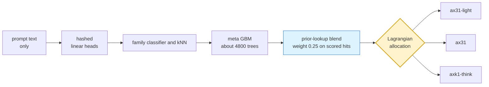

<!--
SPDX-FileCopyrightText: Copyright 2026 SK TELECOM CO., LTD.
SPDX-License-Identifier: Apache-2.0
-->

<div align="center">

# 🧭 SKT LLM Router

**held-out dev 0.7051 · expected 0.7043 · zero busts**

A prompt-only router for the SKT Efficient LLM Routing Challenge.<br>
Pure Python standard library. **No model inference at evaluation time.**

<br>


</div>

---

For each episode it picks one of `ax31-light` / `ax31` / `axk1-think` under a per-tier cost
budget, using only the prompt text. The runtime is pure Python standard library — hashed linear
heads → family/kNN → meta GBM → prior-lookup blend → Lagrangian allocation — and performs no
model inference at evaluation time.

Unlike the previous release, the shipped configuration is priced so that **no tier exceeds its
budget in any of 3,000 bootstrap resamples** across three stress scenarios. The headline and the
expectation are the same number here; read [the limits](#-limits) anyway.

## ⚡ At a glance

| | |
|---|---|
| **Input** | prompt text only — no metadata, no model calls |
| **Decision** | one of `ax31-light` / `ax31` / `axk1-think`, per episode |
| **Constraint** | per-tier cost budget; exceeding a tier's multiplier scores **0 outright** |
| **Runtime** | Python stdlib only, ~48 s per tier estimated against the 90 s limit |
| **Shipped triple** | safety `.90 / .72 / .52` — zero busts in 3,000 resamples × 3 scenarios |
| **Trade made** | **+0.028 in expectation for −0.005 of headline** vs the 0.7100 build |

---

## 🧭 Contents

- [Scores](#-scores)
- [Pipeline](#-pipeline)
- [What this build adds](#-what-this-build-adds)
- [Limits](#-limits)
- [Submission artifact](#-submission-artifact)
- [Reproducibility](#-reproducibility)
- [Layout](#-layout)

---

## 📊 Scores

Held-out protocol: rebuild on Train (1,760 episodes) only, score Dev (880) once, public lookup
stripped so every prompt goes through the full path. `run_repo_chain.sh` does this end to end;
the score below also reproduces from this repository's tree as shipped.

| package | held-out dev | expected score¹ | premium bust risk |
|---|---:|---:|---:|
| `LLM-ROUTE-0.7000` release line (safety .94/.80/.73) | 0.702727 | 0.6760 | 11.4 % |
| the 0.7100 build of this repo's first commit (same triple) | 0.709972 | 0.6719 | 16.6 % |
| 🏆 **this build** — prior-score blend, no-bust triple .90/.72/.52 | **0.705114** | **0.704283** | **0 %²** |

> [!IMPORTANT]
> The earlier headline 0.709972 is not gone — it is the same model at a triple that scores zero on
> premium about **one run in six**. Its honest expectation, 0.6719, is what this build's 0.7043
> should be compared against: **+0.028 in expectation for −0.005 of headline.**

<details>
<summary><b>Footnotes — how the expected score and the bust risk are measured</b></summary>

<br>

**¹ Expected score counts the zeros.** A tier that exceeds its budget multiplier scores 0
outright. Measured by `tools/bust_probability.py`, 3,000 bootstrap resamples with the allocator
re-run inside each one, over three scenarios:

| scenario | what it injects |
|---|---|
| plain | nothing |
| runaway | one injected runaway episode worth 6.5 % of the light baseline |
| cost surprise | 1.25x on `axk1-think`, 1.10x on `ax31` |

**² On those three scenarios.** Under a fourth, stricter stress — half-size batches — premium at
0.52 still busts ~0.2 % of resamples; the fully strict point is premium 0.48 (headline ≈0.7025).
**If the private evaluation batch can be much smaller than Dev's 880 episodes, ship .90/.72/.48.**

</details>

---

## 🔀 Pipeline



Every stage is stdlib. The blend is one sha256 plus a dict probe; on a lookup miss it is a no-op.

---

## ✨ What this build adds

Over the first commit of this repository (real 34B prior column + seed-averaged meta heads):

### 1. Decision-layer prior-score blend — **+0.004 certified**

The prior columns are direct offline measurements — column A (the organiser's own light model, Q6)
agrees with the true light score at corr 0.699 on dev lookup hits, the 34B column with the true
mid score at 0.724 — but fed only as GBM features the stack dilutes them to 0.604 / 0.666.

On a scored lookup hit the runtime now blends the column's own score into the final score row at
weight 0.25 (`prior_score_blend` in the artifact; one sha256 + a dict probe, stdlib).

| certification | value |
|---|---|
| method | stem-grouped paired bootstrap of the whole package, each side at its own no-bust triple |
| mean | **+0.0037** |
| 90 % CI | [+0.0003, +0.0071] |
| P | 0.96 |
| busts | zero on either side |

This transfers to the private set wherever the lookup hits (columns A/C carry ~38k source-rendered
items) and is a no-op on misses.

### 2. A family classifier that is actually right

`similarity.classify_family` was 91.4 % accurate against the true source, and its `aime` bucket was
**69 % GSM8K** — two populations with opposite optimal models under one label, fed to the meta GBM
as a one-hot.

Rebuilt text-only from the data analysis's structural markers:

| | before | after |
|---|---:|---:|
| accuracy vs true source | 91.4 % | **99.85 %** |
| `aime` precision | — | **1.000** (36/36) |

EV-neutral on dev (the GBM had learned around the old noise) but removes that hazard for the
private set. Previous version kept at `src/ossp_router/similarity.py.e66.bak`.

### 3. A reasoning-model prior column

`DeepSeek-R1-Distill-Qwen-14B` output lengths over the public 2,640 — the only proxy that predicts
`axk1-think`'s output length (corr **0.63** vs 0.32 for the real `ax31`'s own lengths). Improves the
think log-cost RMSE 0.677 → 0.661. Coverage is the public items only, so it contributes nothing on
private misses.

### 4. No-bust safety pricing as a first-class tool

| tool | what it does |
|---|---|
| `tools/price_safety.py` | finds, per tier, the largest safety ratio that busts in zero resamples of every scenario |
| `tools/bust_probability.py` | reports pass probabilities and the expected score, with a safety sweep |

Both re-run the allocator inside each resample — **holding the picks fixed overstates the risk
badly.**

---

## ⚠️ Limits

> [!WARNING]
> **The certified gain is small and dev-selected.** The blend weight (0.25) and the triple were
> chosen on Dev; the paired CI is the guard and its lower bound is **+0.0003**. Treat +0.004 as the
> best estimate, **not a floor**.

**The remaining gap is an information limit, measured.** At the no-bust triple, giving the
allocator TRUE scores is worth +0.064; TRUE costs only +0.005 (`tools/e69_decompose.py`). The
score side does not yield:

- predictions are already calibrated — the reliability curve is near-diagonal;
- a dedicated extreme-item head does worse than the shipped ordinal signals (AUC 0.76 vs 0.84);
- the k1 score head cannot tell which hard items k1 will crack (AUC 0.43);
- every feature axis tried — MLP, embeddings, fine-tuned encoders, external routers, more prior
  columns — is closed with evidence in [`EXPERIMENT_LOG.md`](EXPERIMENT_LOG.md).

**Prior coverage does not transfer in full.** Dev coverage 0.975 is partly the public prompts
themselves; an unseen private prompt is covered only through the source-rendered pool. The blend
fires on scored hits and does nothing otherwise.

**Constants are not virgin with respect to Dev.** Blend weights, gain α, rank β were fixed in
earlier rounds that used Dev and CV. Only the model fit is Train-only.

**Runtime margin on arm64 is unverified.** 3-seed meta averaging puts ~4,800 trees in the artifact
(+8 % per episode over single-fit on this laptop). Against the previous round's estimate of
40-50 s per tier on the official Apple Silicon hardware that fits the 90 s limit with room, but it
has not been measured there.

> [!CAUTION]
> **Deployment order matters.** `tools/build_public_lookup.py` stores precomputed rows; it must run
> **AFTER** the `prior_score_blend` field is set, or the stored rows will disagree with the compute
> path.

---

## 📦 Submission artifact

`src/ossp_router/resources/learned-router-submission.v1.json`

| | |
|---|---|
| size | 27.8 MB |
| sha256 | `7984081c57f2e9a97725b8378aa2b5a405775079c7ec8eac41874f5c04ec0450` |
| built on | the **combined public 2,640** per the deployment convention |
| built by | `run_deploy_chain.sh` on a Colab T4 |
| lookup check | generated after the blend field, verified equal to the compute path on the build machine — **max diff 0** over 120 episodes × 3 tiers |

> [!NOTE]
> Its dev numbers are **in-sample** (it trains on dev). The performance claim is always the
> Train-only held-out **0.705114 / expected 0.7043** from `learned-router.v1.json`.

Runtime, measured as a same-machine ratio against a single-fit artifact: **1.31x** on the
lookup-miss path, estimating **~48 s per tier** on the official hardware against the 90 s limit.

**Cross-machine note:** libm exp/log differences flip an occasional GBM split (12/1350 score
comparisons at ≤7e-4 between the build machine and a Windows machine); the shipped lookup rows pin
the public prompts to the builder's answers, so this affects only private-prompt noise, consistent
with the measured 0.0014 cross-machine spread.

---

## 🔁 Reproducibility

```bash
# full chain: Train-only rebuild, Dev scored once
# (GPU for the linear head; cpu_shim substitutes)
ROUTER_META_SEEDS=3 EXTRA_COLUMN=colab-label/prior_column_d_reason.json \
  bash run_repo_chain.sh append

# then set tier_safety_ratios to .90/.72/.52
# and prior_score_blend as in the shipped artifact
```

> [!WARNING]
> The chain is **not deterministic across hardware** — a 0.0014 spread between an RTX 2050 and a
> Colab GPU on the identical build. Only compare numbers produced on one machine.

The previous round's published 0.705568 remains unreproducible from its repository — the seed
averaging it recorded was never implemented there; this line implements it (`ROUTER_META_SEEDS`).

---

## 🗂️ Layout

| path | contents |
|---|---|
| `src/ossp_router/` | the runtime (stdlib only) and the shipped artifact |
| `resources/learned-router-0710.v1.json` | the first commit's 0.7100 build, preserved as shipped — safety .94/.80/.73, no blend; headline 0.709972, expected 0.6719 (premium busts ~1 run in 6) |
| `run_repo_chain.sh` | the build chain; `EXTRA_COLUMN` appends a compiled prior column |
| `tools/price_safety.py` | largest zero-bust safety ratio per tier |
| `tools/bust_probability.py` | pass probability and expected score, with a safety sweep |
| `tools/e69_decompose.py` | score-error vs cost-error decomposition of the oracle gap |
| `tools/e69_package_paired.py` | stem-grouped paired gate for two (artifact, triple) packages |
| `tools/e67_classifier.py` | the family-classifier measurement |
| `analysis/` (in the working line) | full data analysis: 5 tidy CSVs, data dictionary, report |
| [`EXPERIMENT_LOG.md`](EXPERIMENT_LOG.md) | every experiment, including everything rejected and why |
| [`docs/PRIOR_PROVENANCE.md`](docs/PRIOR_PROVENANCE.md) | provenance, licences and SHA-256 for the four offline prior columns |

The label pools (hundreds of MB) are not in the repository; `colab-label/build_pool*.py`
regenerates them from pinned public sources, and the compiled prior columns
(`colab-label/prior_column_{c,d_reason}.json`) let the prior rebuild without them.

---

<div align="center">
<sub>

Apache-2.0 · see [`CONTRIBUTING.md`](CONTRIBUTING.md) before proposing changes — this repository
does not accept external contributions

</sub>
</div>
